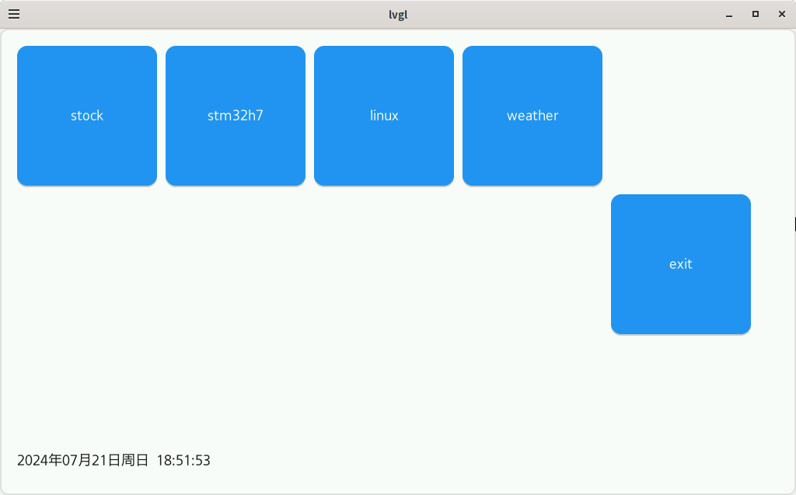
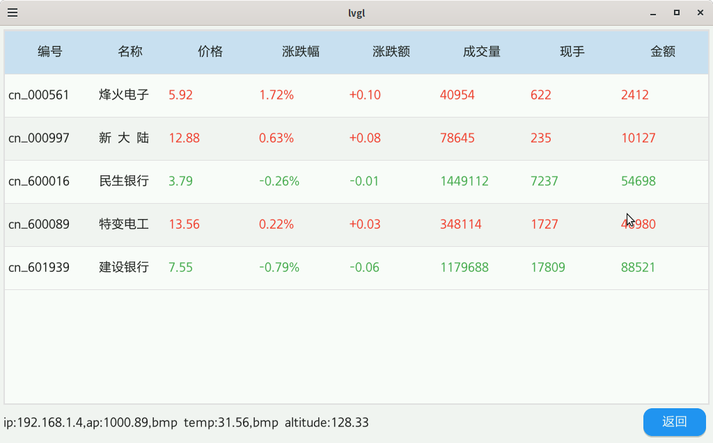
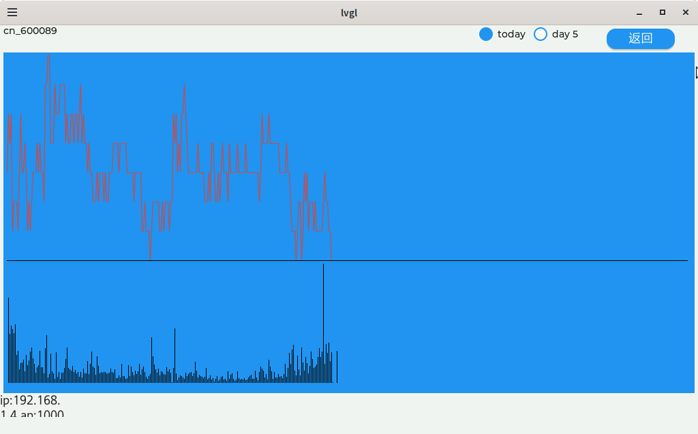
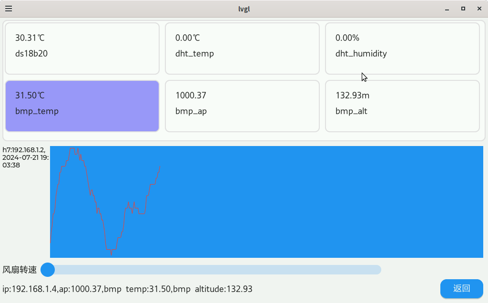
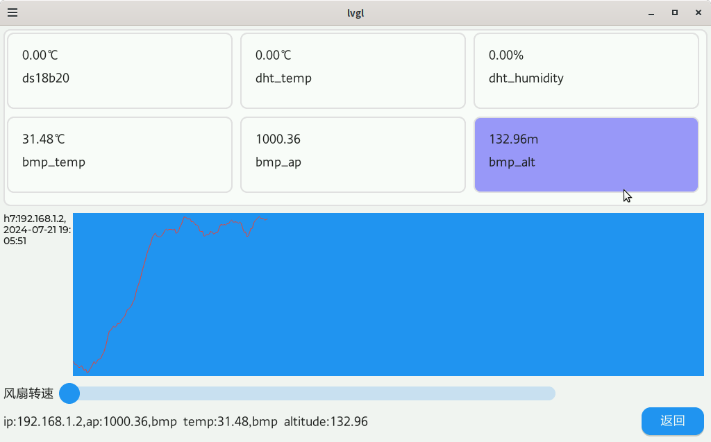
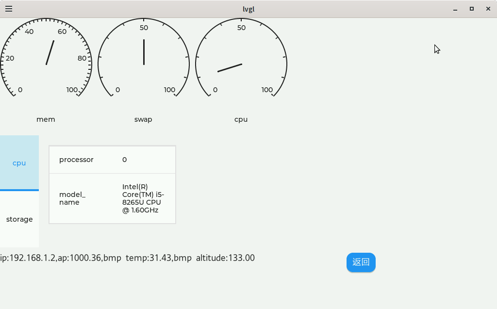
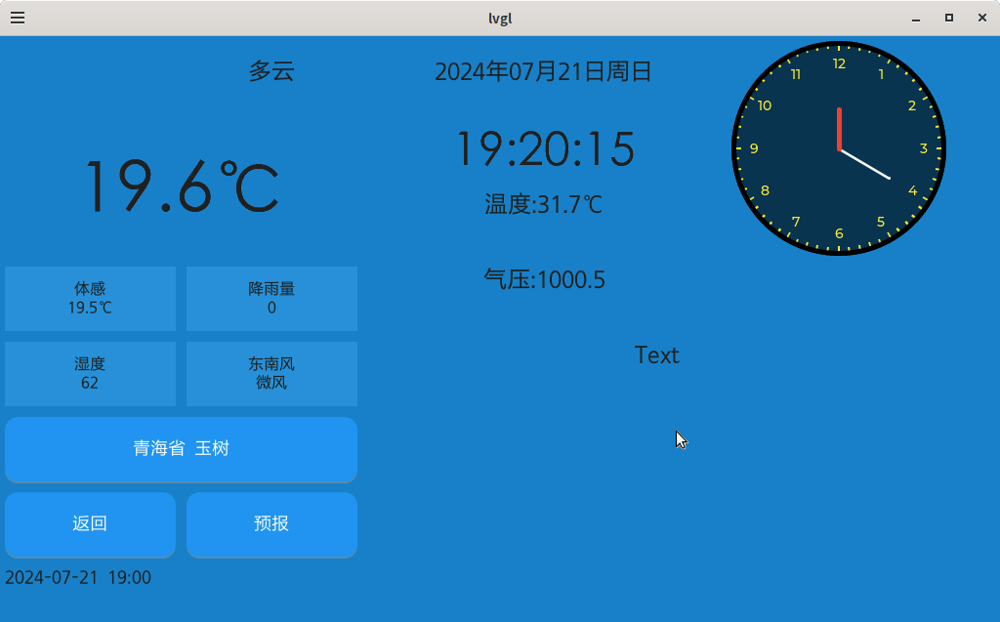
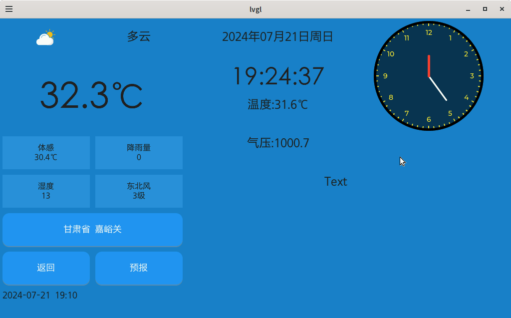
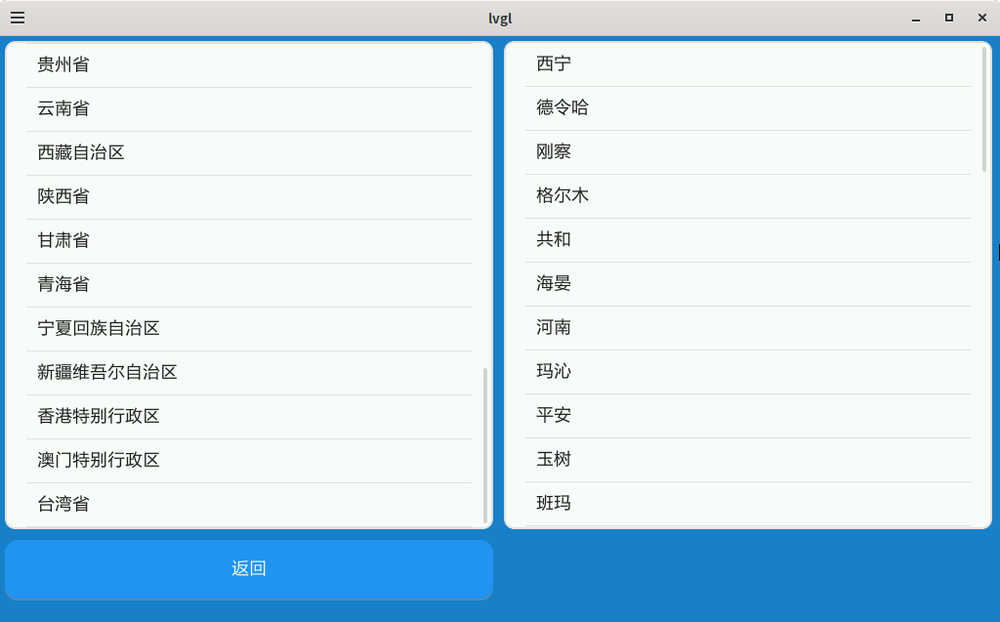
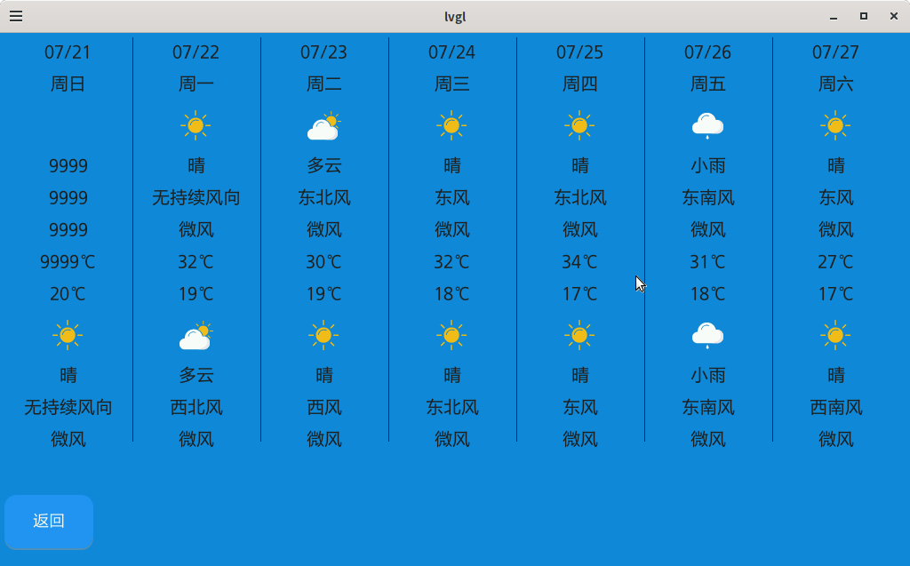

# linuxfb_lvgl_demo
运行与Linux系统的LVGL功能练习，显示天气预报，折线图，pthread后台线程，MQTT收发
* X86下模拟用X11,ARM嵌入式下用fb
* lvgl 9.1.1-dev
* http请求使用curl
* MQTT使用paho.mqtt.c
## 只是LVGL功能的测试，不稳定，网络延迟等原因可能导致卡死
## 启动

## 股票

## 传感器测量(MQTT收到)

## 天气预报

